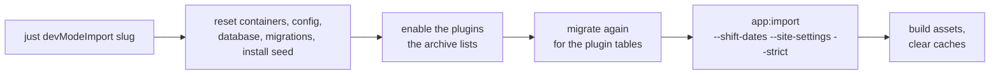

# Demo Data

MeetAgain ships no fixture classes. A development instance is built by importing one of the demo archives
committed in `src/DataImportFixtures/`, or starts empty through the web installer.

---

## Build an instance from an archive

```bash
just devModeImport               # List the archives with their descriptions
just devModeImport weiqi-club    # Build a dev instance from one of them
```

Open `https://meetagain.local` and log in as the archive's owner (see the table below). Every member in
every archive has the password `1234`.



The instance carries exactly the plugins the archive needs. Enable more afterwards with
`just plugin-enable <key>` and `just appMigrate`.

---

## The archives

| Archive                   | Plugins                             | Log in as                  | What it shows                                                           |
|---------------------------|-------------------------------------|----------------------------|-------------------------------------------------------------------------|
| `weiqi-club`              | boardgames, films, photos, wishlist | `Crystal.Liu@example.org`  | The largest community: 18 members, 22 events, five languages, comments  |
| `private-book-club`       | books, wishlist                     | `Kaden.Scott@example.org`  | 50 books and copies lent between members                                |
| `berlin-spanish-circle`   | glossary, wishlist                  | `Lana.Steiner@example.org` | A Spanish glossary, three languages, forum topics                       |
| `berlin-cinephile-club`   | films, photos, wishlist             | `Eduard.Franz@example.org` | Town Hall switched on, a settled and an open film ballot, a wishlist    |
| `berlin-supper-club`      | dishes, wishlist                    | `Natali.Craig@example.org` | A menu grouped by course, dish ballots and likes                        |
| `berlin-karaoke-crew`     | karaoke, wishlist                   | `Candice.Wu@example.org`   | Events and members only - the plugin has no items yet                   |
| `dragon-descendants`      | glossary, wishlist                  | `Crystal.Liu@example.org`  | Chinese as the default language, 308 glossary entries with HSK 1 and 2  |
| `hamburg-board-game-club` | boardgames, wishlist                | `Aston.Hood@example.org`   | 20 games with nested tags, member shelves, bring pledges                |
| `hamburg-shutter-club`    | photos, wishlist                    | `Marco.Gross@example.org`  | 22 attributed photographs with EXIF, tags and comments across two walks |
| `vanilla-group`           | wishlist                            | `admin@example.org`        | Nothing but what a fresh install needs: an owner and a start page       |

Only the members an archive carries exist after the import; the table names the member who comes in as
admin.

### What an archive is

Each directory is an unpacked MeetAgain export: `export.json` plus `images/<sha1>.<ext>`. The same data
always exports to the same bytes, so a change to an archive in a pull request is a real change to the demo
data.

**Dates are anchored to a Monday.** Every archive is exported as of Monday 2026-01-05, which it records as
`exported_at`. `--shift-dates` moves every timestamp by the whole weeks between that Monday and the current
week's, so a Thursday 19:00 meetup is still a Thursday 19:00 meetup - only in the current week. Values that
are not timestamps (plain dates, years, a photo's capture time) never move.

**Never edit an archive by hand.** Maintainer tooling outside this repository regenerates them from its
sample data. CI imports every archive with `--strict` into a fresh database built by the real migrations,
exports the instance again and fails when the row counts differ.

---

## Start empty instead

```bash
just devModeInstaller
# Open https://meetagain.local/install/
```

The installer walks through the database, mail and the first admin account - the same path a self-hoster
takes.

---

## The import and export commands

| Command                                   | What it does                                                  |
|-------------------------------------------|---------------------------------------------------------------|
| `app:import <zip-or-directory>`           | Imports one archive, from a ZIP or an unpacked directory      |
| `app:import:inspect <archive>...`         | Prints what one or more archives hold                         |
| `app:export <zip> [--anchor=YYYY-MM-DD]`  | Exports the whole instance into an archive                    |

`app:import` options:

- `--shift-dates` moves every date by whole weeks, from the week the archive was exported to the current
  week.
- `--site-settings` writes the archive's site block into this instance: site name, description, enabled
  and default languages, theme colours, logo, the feature switches (Town Hall, RSVP notifications, event
  reminders, the upcoming digest) and plugin settings. Run `just appAssets` afterwards so the theme shows.
- `--strict` exits non-zero when any row was skipped or dropped. The rows that did import stay, so reset
  before retrying.

`app:import:inspect --format=` takes `json` (one archive in full, the default), `plugins` (the plugin keys
one archive needs) or `table` (one row per archive).

`app:export --anchor` pins `exported_at` to the Monday of the given date and moves every date by the same
whole weeks - how the committed archives stay byte-stable.

On import, a group's owner and organizers become admins and its members become users. Password hashes
travel as they are, so members log in with their old password.

Run any of them through `just app`, for example `just app "app:import:inspect src/DataImportFixtures/weiqi-club"`.

---

## Import through the admin

**Admin → System → Import** (`/admin/system/import`) runs the same importer in two steps:

1. **Upload a ZIP.** The page shows the archive's name, description, export date, row counts and the
   plugins it needs, flagging those not active here. The file waits on the server until you decide.
2. **Import.** The optional "apply site settings" box is ticked by default while the instance has no
   events. The result lists created, matched, skipped and dropped rows per kind, and applying the site
   settings rebuilds the theme.

---

## Local API keys

The films and board games plugins read `TMDB_API_KEY`, `OMDB_API_KEY` and `BGG_API_TOKEN` from the
gitignored `.env.local` whenever their settings store no key, so a developer's key survives every reset
without being entered again. A key or lookup source saved on the plugin's settings page always wins.
