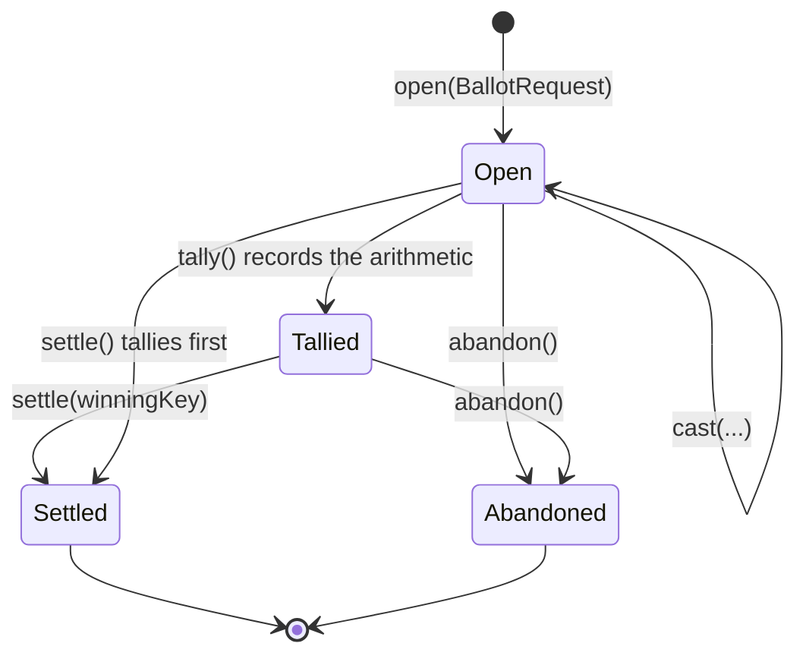

# Ballot

A decision someone deferred, settled once it concludes. A steward opens a ballot over a list of
candidates, members approve the ones they would accept, and on the deadline the winner is handed back
to whoever opened it.

The module is **inert until a consumer opens a ballot**. It ships no ballots of its own, and where none
is open, nothing is shown. That is why it needs no enable flag: a ballot is self-gating in a way a
feature toggle only approximates.

For how modules are built and guarded in general, see [modules/README.md](../README.md).

## It counts, it does not interpret

Everything that varies between one kind of decision and another is answered by the consumer, not here.

| Question                       | Answered by                                                      |
|--------------------------------|------------------------------------------------------------------|
| What are the candidates?       | the caller, when it opens the ballot                             |
| How long is it open?           | the caller, as a deadline on the request                         |
| Approve many, or pick one?     | `TallyMode` on the request                                       |
| Settled by a person or a cron? | `SettlementMode` on the request                                  |
| Who may vote?                  | `ElectorateProviderInterface`, matched on the purpose            |
| What does winning *mean*?      | `SettlementListenerInterface`, matched on the purpose            |
| Who may see it?                | `VisibilityFilterInterface`, an AND-intersection over ballot ids |

**A candidate is a key, not a row.** `Candidate` carries an opaque `string $key` chosen by the opener
plus a display `string $label`. One ballot's options can come from a curated list and another's be typed
in by hand, because the module never resolves a key: it counts them and hands the winner back.

**A subject is a `(type, id)` pair, not a foreign key.** `BallotSubject` says what the decision is *for*
as two scalars, and it is nullable because a decision need not attach to anything. This is why the only
foreign key the module holds into the rest of the application is the voter on `mod_ballot_vote`.

**`purpose` is the routing key.** It is the string all three seams match on. Consumers namespace theirs.

**The title is opaque too.** `BallotRequest::$title` is an optional pre-translated string the ballot
page shows as its heading, falling back to the tally mode's own label. The module stores and echoes it
without resolving anything, exactly as it does a candidate label - without one, a member looking at a
list of open ballots reads the same generic heading on every row.

## Counting, then deciding, are two steps

Tallying records a single winner or the set of tied keys; settling is a separate call. The split exists
because **a tie has no arithmetic answer**, and a tallied ballot has to be able to sit undecided without
losing its numbers. `settle()` on a still-open ballot tallies first, so the arithmetic is always on
record before a winner is committed.

Two rules protect a count from its voters: casting **replaces** a member's previous approvals rather
than adding to them, and a selection is **intersected with the ballot's own option keys**, so a forged
key cannot enter a tally.

Zero votes is reported as undecided, not as every candidate being tied. Both are undecided; they are not
the same situation, and the deadline cron needs to tell an empty ballot from a genuine deadlock.

## The three seams

All three are `#[AutoconfigureTag]`ed and resolved inside the module.

| Interface                     | Chain shape                                              | With nothing registered  |
|-------------------------------|----------------------------------------------------------|--------------------------|
| `SettlementListenerInterface` | first match on the purpose, by priority                  | settles, writes nothing  |
| `ElectorateProviderInterface` | first match on the purpose                               | any authenticated member |
| `VisibilityFilterInterface`   | AND-intersection (`null` = no opinion, `[]` = block all) | everything visible       |

A ballot whose purpose nobody claims settles and writes nothing. That is the correct behaviour rather
than an error: the arithmetic is still true, there is simply nobody who wanted the answer.

`BallotOutcome` carries **both** user ids: `settledByUserId`, which is null when the deadline cron
settled it, and `openedByUserId`, which never is. A listener that has to write as somebody - because
the write it makes is permissioned - reads the second one and does not have to call back into the
module to find out who asked the question.

Visibility and electorate are **not** the same question, and the module keeps them apart. `view()` gates
on visibility alone, so a member who was never entitled to vote can still read a decided result.
`listOpenFor()` and `countOpenFor()` gate on both, because they answer "what can I still vote in".

## Deadlines

`ballot.settle-due` runs on the application's cron chain. It tallies every ballot past its deadline and
settles **only** those whose `SettlementMode` is `Automatic` and whose tally has a single winner. A tie,
or a ballot marked `Confirmed`, is left for a person. Failures are per-ballot: one broken ballot is
logged and the batch continues.

Members hear about ballots they can still vote in through the application's own notification bell.
Telling them about a *settlement* is the consumer's job, through `SettlementListenerInterface`, because
only the consumer knows what actually changed.

## How to become a consumer

1. Inject `Module\Ballot\Contract\BallotInterface` and call `open()` with a `BallotRequest`: a
   namespaced purpose, at least two distinct candidates, a deadline, and the opener's user id.
2. Implement `SettlementListenerInterface` for that purpose. `settled(BallotOutcome $outcome)` is where
   the winning key becomes a real change in your own system.
3. Implement `ElectorateProviderInterface` if the decision is not open to every member, and
   `VisibilityFilterInterface` if not every member may even see it.

`App\Review\FieldBallotService` in the application is the worked example: purpose `contribution.field`,
one candidate per competing value proposed for a field plus one for leaving it alone, and a settlement
that writes the winner through the application's own change-proposal tool. It is also why `Confirmed`
earns its place beside `Automatic`: that consumer's write is permission-checked against the current
request's user, so nothing the deadline cron attempted on its behalf would be allowed through.

### Use the module's page, or keep your own

Consumers split on one question: **do members need to look at the candidates, or only read them?**

|                | The module's page                | Your own page                                               |
|----------------|----------------------------------|-------------------------------------------------------------|
| Candidates are | strings a member can read        | rows a member has to see - posters, photos, dishes          |
| You implement  | the three seams                  | the three seams, plus a controller and a template           |
| You call       | `open()`                         | `open()`, then `view()` to render and `cast()` to record    |
| Example        | `App\Review\FieldBallotService`  | `App\Item\Ballot\*`, `Plugin\Photos\Service\ContestService` |

The module renders `Candidate::$label` as plain text and will keep doing so. Teaching it to resolve a
key into a picture would make it interpret its candidates, which is the one thing it refuses to do. So
a consumer whose ballot is a wall of film posters keeps its own page and drives this contract from it -
the module still owns the decision, the arithmetic and all three seams; only the pixels are yours.

`templates/_components/ballot_tiles.html.twig` in the application is the shared tile grid those pages
render, so a second such consumer copies a template rather than inventing one.

### You cannot reach the deadline from outside

There is no public way to make a ballot due: `cast()` requires a deadline still in the future, and
moving one needs this module's own tables. That is deliberate, and it shapes how a consumer tests.

Prove your settlement listener through `cast()` and `settle()` - that the winning key becomes the right
change in your system, and that a tie changes nothing. The step you cannot reach, that `ballot.settle-due`
turns a passed deadline into exactly those calls, is covered by the project's own functional suite and
needs no second proof per consumer.

Nothing outside this directory may import `Module\Ballot\Internal\**`; Mago Guard fails the build if it
does. `Contract/` is the whole public surface and speaks in scalars, enums and readonly value objects.

## Moving ballots between instances

`exportAll()` and `restore()` serve data movers only. The first returns every ballot with its options, votes and
outcome, regardless of visibility; the second writes one back exactly as given. It never tallies and never calls a
settlement listener, so a settled ballot keeps its recorded outcome even when some of its votes stayed behind. The
application's archive section is the one caller, and it decides per purpose which ballots and votes leave.

## Files

| Path                                  | Holds                                                           |
|---------------------------------------|-----------------------------------------------------------------|
| `modules/ballot/src/Contract/`        | the public surface: `BallotInterface`, the three seams, the VOs |
| `modules/ballot/src/Internal/`        | the engine, the registries, the cron, the page                  |
| `modules/ballot/src/Internal/Entity/` | `Ballot`, `BallotOption`, `BallotVote`                          |
| `modules/ballot/migrations/`          | namespace `ModuleBallotMigrations`                              |
