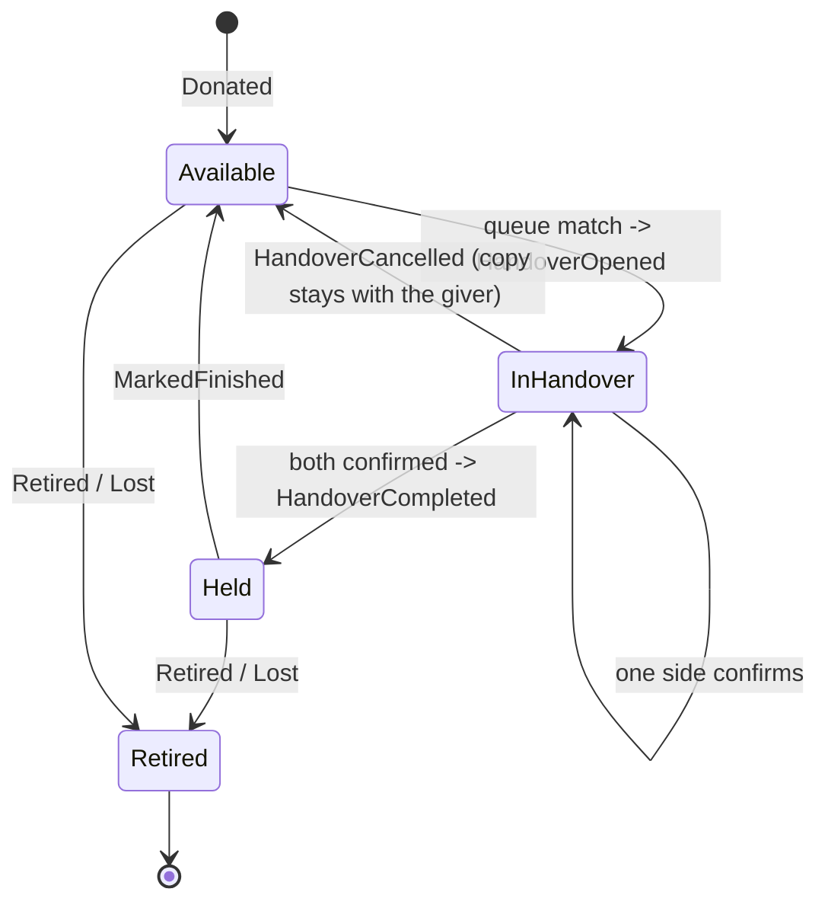

# Circulation

Physical copies of an item travelling between members: who donated one, who holds it now, who is queued
for it, and every move it ever made. Every row is keyed by `(itemType, itemId)`, like the comment and tag
seams, so the module carries the whole system without knowing what a book is.

The module is **inert until a plugin switches an item type on**. With no participation provider saying
yes, no badge, panel or dashboard appears anywhere.

For how modules are built and guarded in general, see [modules/README.md](../README.md).

## The four tables

`mod_circulation_copy` is one physical object; `mod_circulation_request` is a place in a waiting list;
`mod_circulation_handover` is a live two-sided negotiation; `mod_circulation_ledger` is append-only history.

The first three are working state and may be edited. The ledger may not: `Internal\Entity\LedgerEntry` has a
constructor and no setters, `LedgerService::append()` is its only writer during normal operation, and a
mistake is corrected by appending, never by editing. It carries two dates, `occurredAt` and `recordedAt`,
which diverge whenever a confirmation lands late.

**The ledger is the truth; `Copy.holder` is a cache of it.** The denormalised holder, its `heldSince` and the
copy status exist so a list page does not replay history, and they must always be reproducible by replaying
the ledger. `LedgerReplay` is that replay and `app:circulation:rebuild [--context=] [--dry-run]` is the
standing proof: `--dry-run` reports drift and exits non-zero, without it the derived columns are rewritten
from the ledger.

## The waiting list is per title, not per copy

A member requests *the item*, and the module matches them to whichever copy frees up first. That is what
makes "there are three copies of this one" work at all. A member holds one place per title, enforced by a
unique index over `(context, item_type, item_id, user_id, open_slot)` - `open_slot` is `1` while the request
is `Waiting` or `Offered` and `null` once it closes, and MySQL treats rows with a NULL in a unique index as
distinct, so the constraint binds on exactly the open rows.

## The state machine

Implement nothing beyond this; the unit tests assert it.

Two things the diagram encodes that are easy to get wrong:

- **`holder` and `status` answer different questions.** `holder` is where the object physically is;
  `Available` means it is up for grabs. A donor holds their own copy from the moment they add it, and a
  member who marks a copy finished keeps holding it until a handover completes.
- **A cancelled handover returns the copy to `Available` and the requester to `Waiting`.** It does not
  re-offer immediately - that would hand it straight back to the person who just cancelled. The daily cron
  re-matches free copies to waiting queues.

## The handover is two-sided, and its chat is a comment target

The copy only moves when both the giver and the receiver confirm. `HandoverService::confirm()` is idempotent
per side, completes only on the second *distinct* side, and refuses a non-participant. A handover whose giver
is `null` - the account was deleted - completes on the receiver alone.

The chat on the handover page is the application's comment section under the target type
`CirculationInterface::COMMENT_TARGET`. `Internal\Comment\HandoverTargetProvider` makes it a **private**
target: `canComment()` is true only for the two participants while the handover is `Open`, and the page itself
is gated to participants plus stewards. Its `onCommentCreated()` is deliberately empty - handover chat never
reaches the activity log. The bell entry for an unread message is derived on read through
`CommentService::isUnreadBy()`.

## The contract

Everything outside the module talks to it through `Module\Circulation\Contract\`. The seams are all
`#[AutoconfigureTag]`ed and resolved inside the module.

| Member                               | Shape                            | Answers                                        |
|--------------------------------------|----------------------------------|------------------------------------------------|
| `ParticipationProviderInterface`     | first non-null wins              | does this item type circulate right now        |
| `ContextProviderInterface`           | first non-null wins, by priority | which shelf a row belongs to                   |
| `EligibilityProviderInterface`       | AND-composed, null abstains      | may this member join this waiting list         |
| `DashboardTabInterface`              | union, ordered by priority       | one more tab on the dashboard                  |
| `TrustEnabledProviderInterface`      | first non-null wins              | is this item type's circulation scored         |
| `CirculationInterface`               | the one injectable service       | contexts, and moving shelves between instances |
| `CopyStatus`, `RequestStatus`, ...   | enums                            | the states in the diagram above                |
| `PortableShelf` and its four row VOs | readonly value objects           | a shelf's rows, for export and restore         |

`ContextProviderInterface` mints an **opaque** string and the module never parses it. The internal
`DefaultContextProvider` returns the item type key at the lowest priority, so a standalone install has one
shelf per type. A plugin may split shelves by any key it likes, and two shelves stay apart even when both
reference the same item row.

`EligibilityProviderInterface` has **no default implementation** and is inert until something registers one.
It is consulted in the *request* path, not at handover time, so somebody below a bar is told why before they
ever join the queue - which is why its verdict is an `EligibilityVerdict` carrying a translation key and
parameters rather than a bare bool. It receives the member as an `int $userId`, as every contract member does.

Visibility rides the application's item filter chain: every read narrows through `App\Item\FilterService`
first, so a copy of an item the serving host hides is never returned. Nothing about host scoping is the
module's own.

Item deletion is handled by `Internal\ItemDeletionHandler`, on the application's item action chain: open
requests and handovers are cancelled, the copies retired, and `Retired` entries appended. The history
survives; the live rows stop pointing at a dead item.

## Surfaces

`Internal\Twig\Extension` publishes `circulation_badge()`, `circulation_panel()`,
`circulation_dashboard_url()` and `circulation_warm()`. All return nothing when the participation chain says
the type is off, so a plugin template calls them unconditionally - see
`plugins/books/templates/book/detail.html.twig`.

`circulation_warm(itemType, itemIds)` is the N+1 guard: a list page calls it once before its loop and every
later `circulation_badge()` reads a per-request memo. `plugins/books/templates/item/list_body.html.twig` is
the reference.

The dashboard at `GET /circulation/{itemType}` is 404 when the type does not circulate. Its six built-in
tabs (Shelf, Waiting, Handovers, Activity, Stats, About me) are rendered by `DashboardService`; anything else
registers a `DashboardTabInterface`. **About me** is Stats narrowed to the viewer - what they hold and since
when, their place in every queue they joined, the handovers waiting on them, and the copies they donated -
all scoped to the serving context, so a member of two shelves sees two different pages. When trust is on it
gains a sidebar from `trust_explanation()` showing where their standing came from; that call returns an
empty string with trust off, and the template drops the column rather than rendering an empty one. Every
mutation is POST + CSRF, validated before any entity lookup.

Routes keep the application's `app_circulation_*` names, and templates live under `@Circulation/`.

## Trust integration

Optional, and inert unless a consumer switches it on. `Internal\Trust\` implements the Trust module's
contract - circulation depends on Trust, never the reverse. See [modules/trust/README.md](../trust/README.md).

- `ContextIndex` is the single answer to "is this context one circulation owns" - it unions the currently
  resolved context per trust-enabled item type with every context found on existing copies. Nothing else
  parses a context string.
- `LedgerActionSource` declares `circulation_handover_completed` (5 points) and `circulation_donation` (25)
  and replays the ledger for them. A completed handover rewards **both** sides; one with no giver rewards the
  receiver alone.
- `ParticipationEligibilityProvider` plugs the minimum into the eligibility chain and names the shortfall in
  its refusal.
- `TrustEnabledProviderInterface` is the second switch: a plugin ANDs its own trust flag with its circulation
  flag so a stale setting cannot activate trust on its own.

## Cron

`Internal\Cron\MaintenanceTask` (`circulation-maintenance`) throttles itself to once a day through the
application's state store and does four things: expire offers older than `QueueService::OFFER_WINDOW_DAYS`,
close handovers open longer than `MaintenanceTask::CLOSE_AFTER_DAYS`, re-match free copies against waiting
queues, and count the handovers waiting on a confirmation. The nudge itself needs no work: the bell entry for
an unconfirmed handover is derived live by `Internal\Notification\NotificationProvider`.

## Moving shelves between instances

`CirculationInterface::export()` and `restore()` serve data movers only. `export(contexts)` returns every row
of those shelves as a `PortableShelf`, visibility ignored; `restore()` writes a shelf back exactly as given,
without matching queues, logging activity or notifying anyone.

Rows point at each other by ref. On export a ref is the row's id; on restore it is any number the caller
chose, unique per row kind, and `restore()` returns the new id of every handover so the caller can re-attach
the handover chat. A ref the shelf does not carry resolves to null, and a handover whose copy is missing is
skipped. The ledger's pointer at its handover travels as `PortableLedgerEntry::$handoverRef`, not inside the
payload.

The application's archive section is the one production caller. It decides which rows leave, and files
restored rows under the importing instance's own context.

## What the module reaches for

The outbound permit list in `tests/config/mago.toml` names every domain dependency, each with its reason.
Substrate (`@global`, `Doctrine\**`, `Symfony\**`, `Twig\**`, `Psr\**`) is permitted as for every module.

| Dependency                                                          | Why                                                          |
|---------------------------------------------------------------------|--------------------------------------------------------------|
| `App\Entity\User`                                                   | the foreign keys on copy, request, handover and ledger       |
| `App\Controller\AbstractController`                                 | the controller extends core's, as plugin controllers do      |
| `App\CronTaskInterface`, `CronTaskResult`, `CronTaskStatus`         | the maintenance task on the cron chain                       |
| `App\Service\AppStateService`                                       | the maintenance task throttles itself to once a day          |
| `NotificationProviderInterface`, `NotificationItem`                 | handovers and queues on the notification bell                |
| `App\Item\ActionInterface`, `App\Enum\ItemAction`                   | copies of a deleted item are retired                         |
| `App\Item\TypeRegistry`, `App\Item\FilterService`                   | type labels, and every read narrows through the filter chain |
| `App\Activity\ActivityService`, `App\Activity\MessageAbstract`      | donations, requests and handovers in the activity log        |
| `App\Comment\TargetProviderInterface`, `App\Comment\CommentService` | the handover chat, and the unread-chat bell entry            |
| `Module\Trust\Contract\**`                                          | the optional trust integration                               |

It is a long list next to Trust's two entries. That is the honest measure of how woven into the application
circulation is, and the point of the list is that it is written down and cannot grow without a decision.

## How to become a consumer

1. Implement `ParticipationProviderInterface` for your item type and answer from your own settings.
2. Call `circulation_warm()`, `circulation_badge()` and `circulation_panel()` from your templates.
3. Optionally implement `TrustEnabledProviderInterface`, `EligibilityProviderInterface` or
   `DashboardTabInterface`.
4. Implement `ContextProviderInterface` only if one shelf per item type is not what you want.

The books plugin is the reference: `plugins/books/src/Circulation/` holds its two providers, a few lines each.

Nothing outside this directory may import `Module\Circulation\Internal\**`; Mago Guard fails the build if it
does.

## Files

| Path                                       | Holds                                                               |
|--------------------------------------------|---------------------------------------------------------------------|
| `modules/circulation/src/Contract/`        | the public surface: the seams, the facade, the enums, the VOs       |
| `modules/circulation/src/Internal/`        | queue, handover and ledger services, the replay, the export/restore |
| `modules/circulation/src/Internal/Entity/` | `Copy`, `Request`, `Handover`, `LedgerEntry`                        |
| `modules/circulation/src/Internal/Trust/`  | the Trust module integration                                        |
| `modules/circulation/templates/`           | the dashboard, the handover page, the badge and panel components    |
| `modules/circulation/migrations/`          | namespace `ModuleCirculationMigrations`                             |
