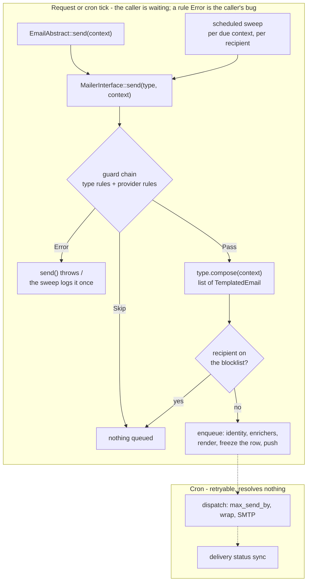

# Email

The engine every outgoing mail runs through: the guard chain, the queue, templates, the layout, the
blocklist, the send log, scheduled sweeps, dispatch and delivery status. It knows no email type. The
application's types - and any a plugin adds - describe a message; the module decides whether it goes out,
freezes how it looks, and sends it.

For how modules are built and guarded in general, see [modules/README.md](../README.md).

## The module owns the engine, not the messages

What a message says and who may receive it is domain code, so it stays outside:

- the email types and `App\Emails\EmailAbstract`, their convenience base
- the guard rules in `App\Emails\Guard\Rule\`
- the shipped template bodies in `templates/email/defaults/`, served by `App\Emails\CoreTemplateProvider`
- the request-derived sending identity, `App\Emails\RequestSendingIdentityProvider`
- `AudienceFilterService`, which narrows installation-wide recipient lists before a type is ever called
- `app:email:preview`, a thin command over `PreviewSweepInterface`

Everything else in this README is the module's.

## One pipeline, whatever triggered the mail

A type only **composes**. Calling `send()` on it hands the type to `MailerInterface::send()`, and the
scheduled sweep calls the same method once per recipient, so a triggered mail and a cron mail take the same
path and meet the same checks.

The guard chain is the type's own `getGuardRules()` followed by every `GuardRuleProviderInterface`'s rules
for that identifier; the first result that is not a pass decides. `SendOutcome` reports what happened: the
guard result, and how many messages were queued.

**The blocklist is checked on the composed recipient address**, so it covers every type, including ones whose
recipient is not a member, without a rule having to be declared. A row queued before an address was blocked
is still sent; dispatch does not re-check.

**The context array is opaque.** It carries whatever the type needs - entities included - from the caller
back to the same type's `compose()` and rules. The module passes it through and never reads it; the sweep
only merges the recipient in under the `user` key. The guard cannot see inside an array, so this is a rule
written here rather than enforced.

## Enqueue decides everything, the send path resolves nothing

Enqueue resolves the sending identity, runs the context enrichers, renders subject and body, and freezes the
result onto the queue row: the rendered fragment, and the identity as a `_layout` snapshot. Dispatch, under
cron, reads only the row, lookups keyed by stored values, the layout template and the translation catalogue.
No request, no membership query, no provider chain. `LayoutRendererTest` proves it by wrapping a frozen row
with every live resolver replaced by one that throws.

Two things stay unfrozen on purpose: the layout template and its footer strings are rendered at send time, so
a layout or wording change reaches mail that is already queued. A row that carries no `_layout` is sent as the
bare body with a logged warning rather than branded from live state.

`host`, `url` and `greeting` belong to enqueue: it takes them from the resolved identity and overwrites
whatever a type or an enricher set, so a mail's links land on the same place its logo and footer name.

### Who is sending

`EmailInterface::getOrigin()` names the entity a message is about. Each `SendingIdentityProviderInterface`,
in priority order, may turn it into a `SendingIdentity` - name, URL, logo URL, sign-off, footer links,
optional attribution - and the first non-null answer wins. The application registers
`RequestSendingIdentityProvider` at the lowest priority, which answers from the live request; if every
provider defers, enqueue throws. A provider that answers for types with no origin must do so from stored
data or the request host, never from anything only a cron run lacks.

The logo is a remote image URL, never a MIME part. The URL is frozen; the bytes behind it are not, so a changed
logo reaches mail already sent. A `null` logo URL means no header image.

## Templates are keyed by the type's identifier

`getIdentifier()` is the primary key of the whole system: the queue row stores it, the stored template is
looked up by it, and the admin pages list by it. Default subjects, bodies and variables come from
`TemplateProviderInterface` implementations, merged in priority order, so a provider registered after the
application's can replace a shipped template by reusing its identifier.

Substitution escapes every value except the variables a `TemplateDefinition` lists in `htmlVariables`. The
list is per template: reusing a variable name in another template does not make it raw there. Subjects are
never escaped.

A stored row must exist before an identifier can be queued. `app:email-templates:seed` creates the missing
ones and, with `--overwrite`, resets every translation to the shipped default - discarding admin edits.
Editing a default on disk does not otherwise reach an existing install. `TemplatesInterface::seedLanguage()`
adds a newly enabled language to every stored template that lacks it.

## Scheduled mail is swept, not triggered

A `ScheduledEmailInterface` returns `DueContext`s from `getDueContexts(now)`, each with its potential
recipients. The sweep runs every recipient through the pipeline above and calls `markContextSent()` once per
context, not once per recipient. It runs between 07:00 and 22:00 only; types do not check the time.

`getMaxSendBy()` lets a type refuse to be sent late: a reminder or a cancellation notice is useless after the
event starts. It is frozen at enqueue, and a row past its cap is marked late instead of sent. Token-carrying
mail does not set one - the token has its own expiry.

## Push notifications ride the enqueue

Every `PushDispatcherInterface` is called for each queued message, after the row is persisted and before the
flush. A dispatcher must not throw and must not flush; one that throws anyway is logged and skipped. A type
whose mail follows a ping sent elsewhere returns `false` from `pushOnEnqueue()`, and the sender of that ping
calls `MailerInterface::dispatchPush()` directly. The preview sweep and the debugging page never push.

## Delivery status is the sending provider's answer

`DeliveryProviderInterface` is a provider chain: the first implementation whose `isAvailable()` is true
answers. Both shipped providers read the same `MAILER_DSN` that decides who sends, so the sender and the
reporter cannot disagree. With none available, the send log hides its sync button and the sync task reports
"provider unavailable" instead of failing.

| Provider                       | Claims when `MAILER_DSN` is          | Reports                                                  |
|--------------------------------|--------------------------------------|----------------------------------------------------------|
| `MailpitEmailDeliveryProvider` | `smtp://mailpit:...` (the dev stack) | `delivered` for anything Mailpit holds, `null` otherwise |
| `SweegoEmailDeliveryProvider`  | carrying an API key in its user part | the provider's status, bounce type and mailbox provider  |

## The contract

Everything outside the module talks to it through `Module\Email\Contract\`.

| Member                                                                                   | Shape                   | Answers                                            |
|------------------------------------------------------------------------------------------|-------------------------|----------------------------------------------------|
| `EmailInterface`, `ScheduledEmailInterface`                                              | tagged interfaces       | what a type composes, when it is due, its rules    |
| `DueContext`, `ScheduledMailItem`, `Attachment`                                          | readonly value objects  | a due sweep, a planned mail, a file to attach      |
| `GuardRuleInterface`, `GuardResult`, `GuardOutcome`, `GuardCost`                         | interface, VO, enums    | one check and its verdict                          |
| `GuardRuleProviderInterface`                                                             | union                   | extra rules for an identifier                      |
| `MailerInterface`, `SendOutcome`                                                         | the send facade         | send, evaluate the chain, push without a mail      |
| `SendingIdentity`, `SendingIdentityProviderInterface`                                    | VO, first non-null wins | who a message is sent as                           |
| `ContextEnricherInterface`                                                               | chain                   | extra template variables at enqueue                |
| `PushDispatcherInterface`                                                                | all run                 | a push for each queued message                     |
| `TemplateDefinition`, `TemplateProviderInterface`                                        | VO, merged by priority  | default subject, body, variables                   |
| `TemplatesInterface`                                                                     | facade                  | render a stored template, seed a language          |
| `BlocklistInterface`                                                                     | facade                  | is an address blocked, why, block one              |
| `SendlogInterface`, `SentEmail`, `QueueStatus`, `QueueStats`                             | facade, VOs, enum       | what was queued and sent                           |
| `DeliveryProviderInterface`, `DeliveryLog`, `DeliveryLogCollection`, `DeliveryLogFilter` | first available wins    | delivery status from the sending provider          |
| `PreviewSweepInterface`, `PreviewSweepResult`                                            | facade, VO              | one mock mail per type and language (dev and test) |

`TemplatedEmail` crosses the boundary as Symfony substrate: `compose()` returns a list of them.

## Surfaces

The admin area lives at `/admin/email/*` behind `ROLE_ADMIN`, with routes named `app_admin_email_*` and
templates under `@Email/`:

- **Templates** - list, edit per language, preview with the type's mock data, reset to the default.
- **Planned** - scheduled mail due in the next 14 days, and every rule's verdict for one of them.
- **Debugging** - queue any type with mock context to a chosen address. It goes through the queue and the
  blocklist, so the mail waits for cron like any other.
- **Send log** - queued and sent mail, the frozen layout rendered in a sandboxed frame, delivery status sync,
  and "Clear cap & retry" for a row that went late.
- **Blocklist** - add and remove addresses. Adding one that is already blocked keeps its first reason.

It also contributes a bell entry for mail pending longer than an hour, the `email_queue` metrics gauge, and
three cron tasks: `email-queue` (dispatch), `scheduled-emails` (the sweep) and `email-delivery-sync`.
`app:cron --task <identifier>` runs one of them alone.

## What the module reaches for

The outbound permit list in `mago.toml` names every domain dependency. Substrate (`@global`,
`Doctrine\**`, `Symfony\**`, `Twig\**`, `Psr\**`) is permitted as for every module.

| Dependency                                                  | Why                                                                   |
|-------------------------------------------------------------|-----------------------------------------------------------------------|
| `App\Entity\User`                                           | the blocklist entry's `addedBy` foreign key                           |
| `App\Admin\**`                                              | the admin pages build their tabs, top bar, sections and navigation    |
| `App\CronTaskInterface`, `CronTaskResult`, `CronTaskStatus` | the three cron tasks                                                  |
| `NotificationProviderInterface`, `NotificationItem`         | the pending-mail bell entry                                           |
| `App\Metrics\GaugeInterface`, `App\Metrics\Point`           | the queue gauge                                                       |
| `App\Service\Config\ConfigService`                          | mailer address, theme accent for the layout, the delivery sync switch |
| `App\Service\Config\LanguageService`                        | enabled languages for the editor, seeding and the sweep               |

## How to write a type

1. Extend `App\Emails\EmailAbstract` (or implement `EmailInterface` yourself) and pick an identifier.
2. `compose()` returns the messages - one, several, or none - with sender, recipient, locale and context.
3. `getGuardRules()` declares every condition under which the mail must not go out; rules run before
   `compose()`.
4. Override `getMaxSendBy()` if the mail is useless after a deadline, `getOrigin()` if it is about an entity
   that decides who sends it, `getAttachments()` for files read again at dispatch.
5. `getDisplayMockData()` feeds the admin preview, the debugging page and the preview sweep. Mirror what
   production produces, not what it should.
6. Ship a default template through a `TemplateProviderInterface` and run `app:email-templates:seed`.

Nothing outside this directory may import `Module\Email\Internal\**`; Mago Guard fails the build if it does.

## Files

| Path                                 | Holds                                                                            |
|--------------------------------------|----------------------------------------------------------------------------------|
| `modules/email/src/Contract/`        | the public surface: the seams, the facades, the value objects                    |
| `modules/email/src/Internal/`        | mailer, queue and dispatch, templates, layout, blocklist, send log               |
| `modules/email/src/Internal/Entity/` | `EmailQueue`, `EmailTemplate`, `EmailTemplateTranslation`, `EmailBlocklistEntry` |
| `modules/email/templates/`           | the layout and the admin pages                                                   |
| `modules/email/migrations/`          | namespace `ModuleEmailMigrations`; tables `mod_email_*`                          |
