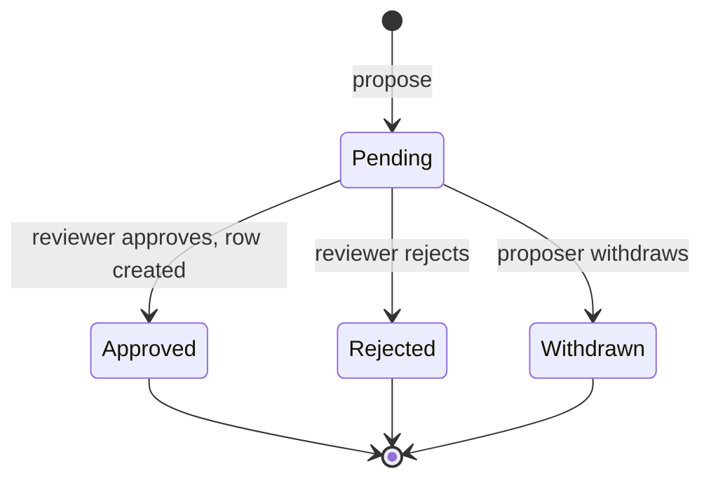

# Suggestion

A member proposes a whole new row, a reviewer edits it, and approving it creates the row. One
`mod_suggestion` table holds each proposal as a JSON payload against a target *type*. A tagged provider
registers an entity type as suggestible, and the module supplies the edit-then-approve page and the
review hub entry.

The module is **inert until a provider registers a type**. With no provider, nothing appears anywhere.

For how modules are built and guarded in general, see [modules/README.md](../README.md).

## The tool owns creation, its sibling owns editing

Two universal review tools sit side by side, and they are not interchangeable.

| Tool                             | Row exists when proposed | Reviewer resolves      | Table             |
|----------------------------------|--------------------------|------------------------|-------------------|
| change proposals (core `Review`) | yes                      | each field, one by one | `change_proposal` |
| this module                      | no                       | the whole thing, once  | `mod_suggestion`  |

A change proposal applies to a target id, and a suggested row has none until approval creates it, which is
why creation could not be folded into the change-proposal tool. The resolution granularity differs for the
same reason: a venue's six fields must be accepted or rejected as one unit, because half a venue is not a
venue.

## The provider hands back an entity and a form, not a schema

`Contract\TargetProviderInterface` returns a real unsaved entity (`newDraft()`, `fromPayload()`) plus the
FQCN of a Symfony form type (`getFormType()`). The member's submit form and the reviewer's edit form are then
literally the same form, and the stored payload is just that form's round-tripped data (`toPayload()`).

The draft crosses the boundary as `object`. It is the consumer's own entity, which the module stores only as
a payload and hands back to the same provider; no module entity ever leaves `Internal/`.

The module never interprets a payload. Display (`describe()`, `summaryRows()`), permission (`canPropose()`,
`canReview()`, both given a user id), validation (`validate()`) and the write itself (`create()`) all live
in the provider.

Core's venue provider, `App\Item\Location\SuggestionTarget`, is the reference implementation: it reuses the
admin venue form verbatim, so a suggested venue is validated by exactly the constraints an organizer-created
one is. The glossary plugin's `GlossaryTarget` is the reference for a **plugin** provider.

### A bespoke approval flag is the thing this tool replaces

A plugin that gates creation with its own boolean on the target table pays for it three times: the pending
row is invisible to the review hub unless the plugin also writes a review provider, every read path grows a
branch to hide rows the table should never have held, and refusing one deletes a real row instead of
keeping a rejected payload. Moving to this tool deletes all three at once, because a proposed row simply
is not in the target table yet.

The rows already sitting in such a column are the migration's problem, and approving them on the way out
publishes text no reviewer read. The glossary plugin's `Version20260906130000` converts each one into a
pending suggestion with the payload shape its provider stores, in `up()` before the drop.

## Status lifecycle

There is no partial state: one row, resolved in one act. `createdId` records which row approval produced,
so the audit trail survives even though the suggestion carries no FK to it. Resolved rows are kept; there
is no retention job.

`validate()` runs twice: at propose time and again inside approval, immediately before `create()`. The
second run is the staleness and uniqueness guard. A duplicate that appeared while the suggestion sat in the
queue is caught *before* the first write, so a collision never leaves a half-created row behind.

## The empty plugin key means core

`Internal\Registry` drops the providers of plugins that are not globally active
(`PluginService::getGloballyActiveList()`), so a suggestion stays resolvable on every host a reviewer works
from. `getPluginKey() === ''` marks a core provider and is always active; without that exemption a core
provider would be silently dropped, because the empty string is never in the active-plugin list.

## The contract

| Member                    | What it is for                                                                           |
|---------------------------|------------------------------------------------------------------------------------------|
| `TargetProviderInterface` | the seam: one implementation per suggestible type, auto-tagged                           |
| `SuggestionInterface`     | the facade: `providerFor()`, `propose()`, `pendingFor()`, `find()`, `restore()`          |
| `View`                    | a suggestion as callers see it: id, type, `Status`, description, summary rows, createdId |
| `Status`                  | the four states, with their label keys                                                   |
| `PortableSuggestion`      | a pending suggestion to store as given, for seeding                                      |

`propose()` returns the provider's refusal as a translated string rather than throwing, because a contract
class must be final and readonly, and an exception cannot be. `restore()` skips permission checks,
validation and activity; it exists for fixtures, and would carry an archive section if suggestions are ever
exported.

## Surfaces

- **Where a member proposes.** The core `/contribute` hub owns the entry point: a section whose type has a
  provider gets a `GET|POST /contribute/{type}/suggest` form, shown from `providerFor()` plus `canPropose()`,
  and lists the member's own pending suggestions from `pendingFor()`. A new provider needs no template
  change.
- **Review hub** (`/profile/review`, identifier `suggestions`): one item per pending suggestion the viewer
  may review, `describe()` as the description and `summaryRows()` as the long description. Inline approve
  takes the suggestion exactly as submitted; inline deny rejects it.
- **Detail page** (`app_review_suggestion`, `/review/suggestions/{id}`): the reviewer gets the provider's
  form pre-filled from the payload and one **Save & Approve** that applies the edits and the decision
  together, or **Reject**. The proposer of a pending suggestion gets a read-only summary and **Withdraw**.
  Anyone else gets a 404, as does everyone once the provider is inactive. Reject and withdraw are
  `data-post` anchors guarded by a `suggestion{id}` token.

## Activity

`core.suggestion_created` (proposer), `core.suggestion_approved` and `core.suggestion_rejected` (reviewer).
Meta carries `target_type`, `created_id` and the provider's `describe()` string. Withdrawing logs nothing.

## How to become a consumer

1. Implement `Contract\TargetProviderInterface`. It is tagged automatically.
2. **Guard uniqueness in `validate()`, not in `create()`**: it is the only hook that runs before the first
   write.
3. **Dispatch your entity actions inside `create()`.** The venue provider dispatches
   `EntityAction::CreateLocation`, which is how other code learns a venue now exists; a row created without
   its action is invisible to everything that listens for it.
4. **No delete path is owed.** A suggestion has no target row, so nothing can orphan it.

## What the module reaches for

| Dependency                                                                                    | Why                                              |
|-----------------------------------------------------------------------------------------------|--------------------------------------------------|
| `App\Entity\User`                                                                             | the proposer and reviewer FKs                    |
| `App\Controller\AbstractController`                                                           | the detail page's controller extends core's      |
| `App\Activity\ActivityService`, `MessageAbstract`                                             | the three activity messages                      |
| `App\Service\Notification\User\ReviewNotificationProviderInterface`, `ReviewNotificationItem` | the review hub entry                             |
| `App\Service\Config\PluginService`                                                            | the registry drops providers of inactive plugins |

The list lives in `mago.toml`, one comment per entry.

## Files

| Path                                                    | Holds                                                                          |
|---------------------------------------------------------|--------------------------------------------------------------------------------|
| `modules/suggestion/src/Contract/`                      | the seam, the facade, `View`, `Status`, `PortableSuggestion`                   |
| `modules/suggestion/src/Internal/SuggestionService.php` | the facade, plus approve, reject and withdraw for the module's own surfaces    |
| `modules/suggestion/src/Internal/Registry.php`          | providers keyed by target type, gated on active plugins                        |
| `modules/suggestion/src/Internal/Controller/`           | the detail page, rendered from `modules/suggestion/templates/review.html.twig` |
| `modules/suggestion/src/Internal/Notification/`         | the review hub entry                                                           |
| `modules/suggestion/src/Internal/Activity/`             | the three activity messages                                                    |
| `modules/suggestion/migrations/`                        | namespace `ModuleSuggestionMigrations`                                         |
| `modules/suggestion/tests/Stub/Target.php`              | a stand-in provider whose verdict, reviewers and created rows a test controls  |
